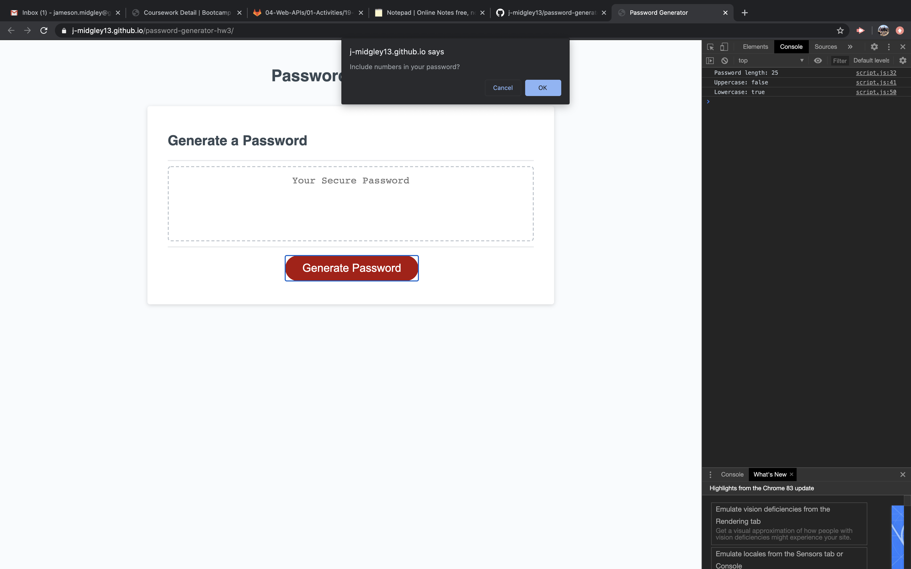
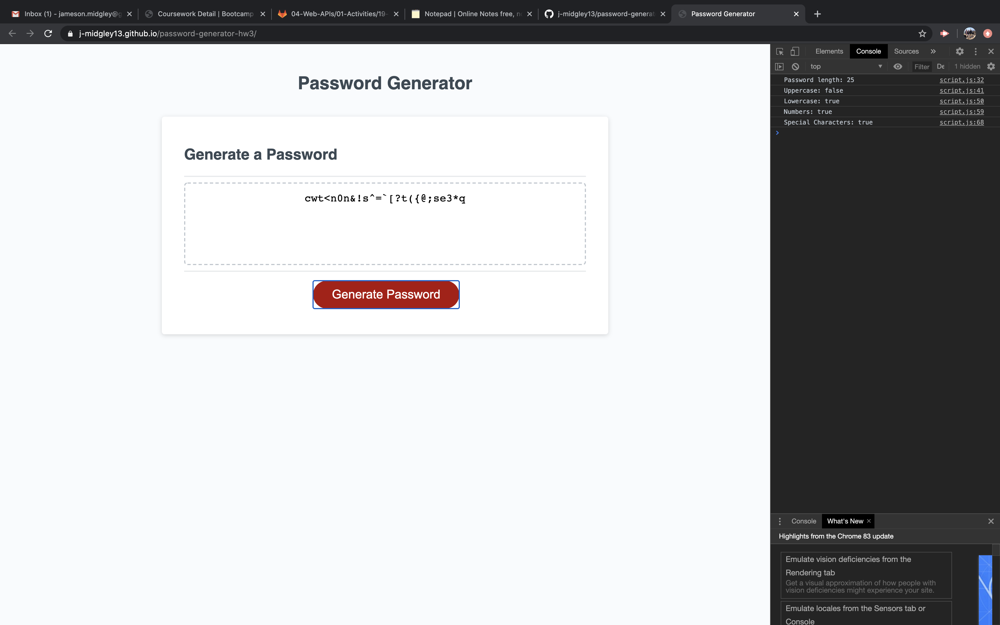

# password-generator-hw3
--------------
## Introduction
--------------
In this assignment, I am tasked with creating a random password given the chosen restraints of the user.
I am to create this using Javascript elements located in my script.js file.

## Criteria
--------------
When generate password button is pressed:
A series of prompts for new password criteria,
User selects criteria as follows: 
 
-Length of password (8-128 characters).
 
-Choose uppercase, lowercase, numeric, and/or special characters.
 
-At least one character type must be selected.
 
-Once criteria is met, new password is displayed.

## Summary
-------------

This assignment was very tricky for me! The use of javascript brings a whole different beast to the table besides using just html and css.  The logic on how things function was fun to learn and implement inside of this assignment.  It is interesting to see how simple user interaction is broken down into so many logical steps. The process made the end result just that much more satisfying! When the user hit the Generate Password button, I was able to get all the required prompts to put what they wanted into a password length of their choice. Even alternative choices such as no character set, or written words for the password length were prompted to restart the process. You have to think of everything!

## Link and Screenshots
---------------

[Link to Password Generator](https://j-midgley13.github.io/password-generator-hw3/)

 

